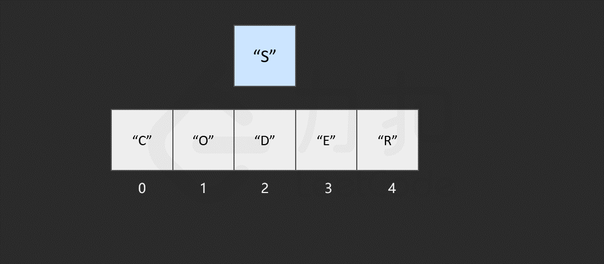

> ## 数组基础
> ### 学习目标
>> - 什么是数组
>> - 数组的读取、查找、插入、删除等基本操作
>> - 数组的在内存中存放
>> - python中如何对数组初始化、数据访问、修改、迭代、排序、添加、删除等操作

### 1 数组的概念
**集合:** 一个或多个确定的元素所构成的整体。
&ensp;( 特性：集合里的元素类型不一定相同；集合里的元素没有顺序)  

**（线性）列表** 按照一定的线性顺序，排列而成的数据项的集合。  

**数组** 列表的实现方式之一  

- 数组有索引，列表没有（最大的区别）除matlab常用的从0算起
- 元素在内存连续存储

### 2 数组的操作

#### 2.1 读取元素

通过访问索引的方式来读取。  

在计算机中，内存可以看成一些已经排列好的格子，每个格子对应一个内存地址。一般情况下，数据会分散地存储在不同的格子中。

对于数组，计算机会在内存中为其申请一段 **连续** 的空间，记下索引为 `0` 处的内存地址。例如：

访问索引为 **2** 处的元素 **"D"** 时，计算机会进行以下计算：

- 找到该数组的索引 `0` 的内存地址： `2008`；
- 内存地址加上索引值，作为目标元素地址，即 `2008 + 2 = 2010`，对应元素为 `"D"`，便找到了目标元素。

时间复杂度O(1)

#### 2.2 查找元素

假如不了解数组中包含的元素，只是想知道其中是否含有元素 `"E"`。  
由于只保存了索引为 0 处的内存地址，只需从数组开头逐步向后查找即可，如果数组中的某个元素为目标元素，则停止查找；否则继续搜索直到到达数组的末尾。

                                                                                      

[^1]: 来自LeetCode中国数组和字符串学习

最坏情况下，查找 `n` 次，`n` 为数组的长度。时间复杂度O(N)

#### 2.3 插入元素

两种情况：

将该元素插入到数组的末尾，只需要一步。即计算机通过数组的长度和位置计算出即将插入元素的内存地址，然后将该元素插入到指定位置。

将该元素插入到数组中的其他位置，首先需要为该元素所要插入的位置 **腾出** 空间，然后进行插入操作。

需要***频繁地对数组元素进行插入操作***，会造成时间的浪费。事实上，另一种数据结构，即**链表**可以有效解决这个问题

#### 2.4 删除元素

删除掉数组中的某个元素后，数组中会留下 **空缺** 的位置，而数组中的元素在内存中是连续的，这就使得后面的元素需对该位置进行 **填补** 操作。

当数组的长度为 n 时，最坏情况下，我们删除第一个元素，共需要的步骤数为 1 + (n - 1) = n 步，其中，1 为删除操作，n - 1 为移动其余元素的步骤数。删除操作具有线性时间复杂度，即时间复杂度为 O(N)。

